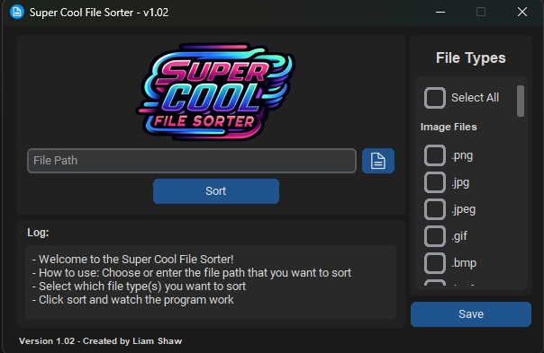

# :file_folder: Super Cool File Sorter
### Version: 1.02  

## :large_blue_diamond: Overview
The **Super Cool File Sorter** is a Python-based desktop application designed to help users easily sort their files into pre-defined categories (e.g., images, documents, videos). It features a dark-mode UI using [customtkinter](https://github.com/TomSchimansky/CustomTkinter) and enables users to save/load their sorting preferences via checkboxes.



This project was built and tested on **Windows 11** and has not been tested on other operating systems.

## :large_blue_diamond: Features
- **:inbox_tray: Sort files into categorized folders** based on their file types (e.g., images, documents, audio files).
- **:file_folder: Save and load** file type selection preferences using JSON configuration.
- **:new_moon: Dark-mode UI** with a sleek, modern look powered by customtkinter.
- **:clipboard: Log panel** for tracking folder creation and file movements.
- **:ballot_box_with_check: Select All/Deselect All** checkbox functionality for quick selection of file types.

## :large_blue_diamond: Installation

### :small_blue_diamond: Option 1: Download the Release (Executable for Windows)

1. Download the latest release from the [Releases page](https://github.com/cramslam/file-sorter/releases).
2. Extract the ZIP file.
3. Run the **filesorter1.02.exe** file to start sorting your files.

### :small_blue_diamond: Option 2: Clone the Repository

#### Prerequisites
- **Python 3.x** is required.
- Install the necessary Python libraries:
  ```bash
  pip install customtkinter pillow
  ```

#### Clone the Repository
1. Clone this repository to your local machine:
   ```bash
   git clone https://github.com/cramslam/file-sorter.git
   ```

2. Navigate into the project folder:
   ```bash
   cd file-sorter
   ```

#### Running the Application
1. Run the application:
   ```bash
   python filesorter1.02.py
   ```

### :small_blue_diamond: How to Use
1. **Select the directory** you want to sort using the file dialog or manually entering the path.
2. **Select the file types** you wish to sort using the checkboxes or click "Select All" for all file types.
3. Click the **Sort** button to begin sorting files into their respective categorized folders.
4. The **log panel** will display which files were moved and the folders created.
5. Save your checkbox selections for later use using the **Save** button.

## :file_folder: Supported File Types :file_folder:
The following file types are supported for sorting:

- **Image Files**: `.png`, `.jpg`, `.jpeg`, `.gif`, `.bmp`, `.heif`, `.heic`, `.pdn`, `.psd`, `.svg`, `.tif`, `.tiff`, `.ico`
- **Document Files**: `.doc`, `.docx`, `.txt`, `.pdf`, `.md`, `.odt`, `.ppt`, `.pptx`, `.rtf`, `.xls`, `.xlsx`, `.log`, `.json`
- **Audio Files**: `.mp3`, `.wav`, `.wave`, `.wma`, `.ogg`, `.aac`, `.flac`, `.m4a`
- **Video Files**: `.avi`, `.flv`, `.mov`, `.mp4`
- **System Files**: `.dll`, `.drv`, `.ini`, `.tmp`
- **Compressed Files**: `.zip`, `.rar`, `.jar`, `.7z`
- **Executable Files**: `.bat`, `.com`, `.exe`, `.msi`

## :small_blue_diamond: AI Disclaimer
The logo for the **Super Cool File Sorter** application was created with the assistance of AI. Please be aware that any resemblance to copyrighted or pre-existing works is purely coincidental.

## :small_blue_diamond: Limitations
- **Windows 11**: This application has only been tested on **Windows 11**. Functionality on other operating systems (Linux, macOS) is not guaranteed.
- **File Permissions**: Ensure you have the necessary permissions for the directories and files you want to sort.

## :small_blue_diamond: Version History
- **v1.02**: Final version with save/load checkbox states, custom icons, and improved UI.
- **v1.01**: Added support for more file types and minor UI tweaks.
- **v1.0**: Initial release with basic sorting and logging functionality.

## :small_blue_diamond: License
This project is licensed under the MIT License - see the [LICENSE](LICENSE) file for details.
